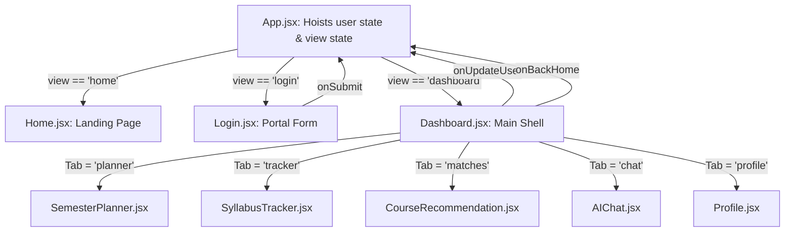

# SiliconPath: Frontend Architecture & Technical Documentation

This document provides a comprehensive technical overview of the **SiliconPath** frontend codebase. It outlines the Single Page Application (SPA) architecture, page-by-page logic, global state architecture, and the design tokens that define the interface.

---

## 1. Directory Structure

The frontend is built using **React + Vite**, structured for modularity and ease of maintenance:

```text
frontend/
├── public/
│   ├── favicon.svg             # Custom silicon die favicon icon
│   └── icons.svg               # Vector icons asset
├── src/
│   ├── components/             # Reusable UI layout elements
│   │   ├── Navbar.jsx          # Header with scroll blur & mobile drawer
│   │   ├── Hero.jsx            # Value prop & CAD dashboard illustration
│   │   ├── FeatureCard.jsx     # Reusable layout card for features
│   │   ├── Features.jsx        # Core ECE features grid
│   │   ├── HowItWorks.jsx      # 3-step timeline with bus traces
│   │   └── Footer.jsx          # Links and licensing footer
│   ├── pages/                  # Top-level views & dashboard tabs
│   │   ├── Home.jsx            # Landing page wrapper
│   │   ├── Login.jsx           # Portal for student details
│   │   ├── Dashboard.jsx       # Layout shell (Sidebar + Canvas Header)
│   │   ├── SemesterPlanner.jsx # Subject planner & credit calculator
│   │   ├── SyllabusTracker.jsx # Checklists, Weak unit alarm & study slots
│   │   ├── CourseRecommendation.jsx # Track filter & elective database
│   │   ├── AIChat.jsx          # Contextual B.Tech advising bot
│   │   └── Profile.jsx         # Indian CGPA & clearances profile
│   ├── styles/                 # Modular CSS matching each component
│   │   ├── Navbar.css
│   │   ├── Hero.css
│   │   ├── Features.css
│   │   ├── HowItWorks.css
│   │   ├── Footer.css
│   │   ├── Login.css
│   │   ├── Dashboard.css
│   │   └── SyllabusTracker.css
│   ├── App.jsx                 # Global state routing & auth guards
│   ├── index.css               # Swiss theme tokens & blueprint grid scan
│   └── main.jsx                # DOM mounter
├── index.html                  # HTML entry point (SEO title & descriptions)
└── package.json                # Dependencies and build scripts
```

---

## 2. State Hierarchy & Data Flow

SiliconPath operates as a Single Page Application (SPA). The global state is hoisted to `App.jsx` and piped down to children via React props.

### 2.1 State Diagrams

The state pipeline and routing flow are structured as follows:



### 2.2 Global State Variables (`App.jsx`)
* **`view`** (`string`): Controls the top-level routing, toggling between `'home'`, `'login'`, and `'dashboard'`.
* **`user`** (`object` or `null`): Holds the active student profile metadata:
  ```json
  {
    "name": "Rahul Sharma",
    "rollNo": "22ECE1014",
    "university": "JNTU",
    "semester": "sem-3",
    "track": "vlsi",
    "cGpa": "8.5",
    "gradTerm": "Semester 8"
  }
  ```

### 2.3 Authentication Guards
If a student attempts to navigate directly to `'dashboard'` without completing their portal profile, `App.jsx` intercepts the request and automatically redirects them to the `'login'` page, acting as a simple, client-side route guard.

---

## 3. Webpages & Views Specifications

### 3.1 Landing Page (`pages/Home.jsx`)
* **Purpose**: Represents the public entry point. Markets the platform and redirects users to sign up.
* **Key Components**:
  * `Navbar`: Floats sticky at top. Adds background blur upon scroll. Translates three `<span>` lines into a close `X` on mobile viewport clicks.
  * `Hero`: Displays an editorial headline paired with a CSS-animated mockup layout of the planner nodes, workload gauges, and elective recommendation tags.
  * `Features`, `HowItWorks`, and `Footer`.

### 3.2 Login Portal (`pages/Login.jsx`)
* **Purpose**: Collects student information to configure their ECE database profile.
* **Form Inputs**:
  * Name (text input)
  * Roll Number / ID (text input)
  * University (text input)
  * Current Semester (dropdown select)
  * ECE Specialization (dropdown select)
* **Trigger**: Submits the form data via `onSubmit` to overwrite the parent `user` state and transitions routing to the dashboard.

### 3.3 Dashboard Container (`pages/Dashboard.jsx`)
* **Purpose**: Serves as the primary application panel.
* **Layout Grid**:
  * Split into a `240px` sidebar menu and a fluid header/canvas layout.
  * Sidebar buttons toggle a local state `activeTab` (`'planner'`, `'tracker'`, `'matches'`, `'chat'`, `'profile'`).
  * Canvas header reads the global `user` prop to dynamically greet the student: `Welcome, {user.name} ({user.university})` and display their active specialization and term indicators.

### 3.4 Semester Planner (`pages/SemesterPlanner.jsx`)
* **Purpose**: Handles credit hour load planning and subject configurations.
* **State**: Local array `semesters` pre-loaded with standard B.Tech syllabus tracks.
* **Operations**:
  * **Add Course**: Takes input parameters (Subject Code, Subject Name, Credits, target Term) and appends a new block to the semester array.
  * **Remove Course**: Deletes a course from the selected semester array.
* **Logic Calculations**:
  * Accumulates credits per semester using `Array.reduce()`.
  * **Overload Alarm**: If a term's credits exceed `20`, displays an `OVERLOAD` warning.
  * **Underload Alarm**: If credits drop below `12`, displays an `UNDERLOAD` warning.

### 3.5 Syllabus Tracker (`pages/SyllabusTracker.jsx`)
* **Purpose**: Manages subject-topic checklists, scans for weak units, and suggests revision plans.
* **Curriculum Database**: Houses the core ECE B.Tech syllabus tracks (Sem 3-6) matching `PTSP`, `EMI`, `DS`, `ADC`, `EMTL`, `MPMC`, `LDIC`, `DSP`, `AWP`, etc.
* **Checklist Logic**:
  * Toggles boolean completion values inside the local state `completedTopics`.
  * Computes progress rate (`completedCount / totalCount * 100`) for each subject.
  * **Weak Topic Detector**: If a subject's progress falls below **`50%`**, all remaining unchecked topics in that subject are flagged as "Weak Topics" and loaded into a backlog.
  * **Revision Planner**: Groups the weak backlog topics and maps them dynamically to weekly slots (Monday through Friday) to suggest study focus.

### 3.6 Course Recommender (`pages/CourseRecommendation.jsx`)
* **Purpose**: Suggests specialized technical electives.
* **Logic**:
  * Displays technical course cards grouped by track (VLSI, DSP, Robotics, Power).
  * Audits prerequisite clearance states against completed subjects to mark electives as `CLEARED` (green checkmark) or `LOCKED` (red padlock).

### 3.7 AI advising Chatbot (`pages/AIChat.jsx`)
* **Purpose**: Provides quick curriculum guidance.
* **Logic**:
  * Simulates chatbot interactions.
  * Reads user inputs. If they query ECE terms like `DSP`, `MPMC`, or `VLSI`, the local regex engine outputs exact B.Tech prerequisite answers and credit-balancing guidelines.

### 3.8 Student Profile Editor (`pages/Profile.jsx`)
* **Purpose**: Allows editing target parameters.
* **Inputs**:
  * CGPA goal (Indian 10.0 scale input)
  * Specialization radio select
  * Target Graduation Semester
* **Callbacks**: Updates the parent `App.jsx` user state immediately using `onUpdateUser` props.

---

## 4. Styling & Swiss Modernist Theme Guidelines

SiliconPath rejects generic AI templates and vintage grids, utilizing a **"Swiss Modernist"** technical layout.

### 4.1 Global Custom Properties (`index.css`)
```css
:root {
  --bg-dark: #08090d;          /* Obsidian Midnight */
  --bg-surface: #11131a;       /* Carbon Graphite */
  
  --primary: #2f62ff;          /* Electric Cobalt Blue (blueprint ink) */
  --secondary: #ff5a36;        /* Vibrant Tangerine (live copper) */
  --tertiary: #10b981;         /* Status Green */
  
  --font-sans: 'Plus Jakarta Sans', system-ui, sans-serif;
  --font-heading: 'Plus Jakarta Sans', var(--font-sans);
  
  --radius-sm: 4px;            /* Sharp, industrial corners */
}
```

### 4.2 Background Grid & Scanner laser Animation
* **Drafting Grid**: Built using CSS radial-gradients to overlay a dotted technical grid over the obsidian background.
* **Blueprint Scanner laser**: A horizontal line with a semi-transparent Cobalt gradient that sweeps down the screen every 10 seconds using a CSS keyframe animation (`@keyframes blueprint-scan`), simulating a scanner load:
  ```css
  body::after {
    content: '';
    position: fixed;
    top: 0;
    left: 0;
    width: 100%;
    height: 1.5px;
    background: linear-gradient(90deg, transparent, rgba(47, 98, 255, 0.4) 30%, rgba(47, 98, 255, 0.4) 70%, transparent);
    animation: blueprint-scan 10s linear infinite;
  }
  ```
