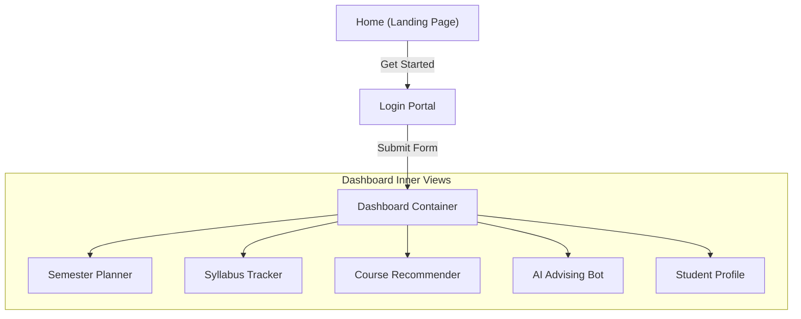

# SiliconPath: Webpage Mechanics & Developer Walkthrough

This document serves as the complete developer guide detailing the inner workings of every webpage and view in the **SiliconPath** B.Tech ECE Academic Planning platform.

---

## 1. Global Application Shell & Routing Architecture

### [App.jsx](file:///c:/Users/harsh/semester-intelligence-platform/frontend/src/App.jsx)
The application operates as a client-side Single Page Application (SPA). The router is a lightweight, state-driven switch that manages view transitions based on the hoisted states.

#### State Definitions
* **`view`** (`string`, default: `'home'`): Controls which top-level container is rendered. Valid states:
  * `'home'`: Public landing page.
  * `'login'`: Registration & profile setup form.
  * `'dashboard'`: Core student environment.
* **`user`** (`object | null`, default: `null`): Holds the active student profile. Structure:
  ```json
  {
    "name": "Rahul Sharma",
    "rollNo": "22ECE1014",
    "university": "JNTU",
    "semester": "sem-3",
    "track": "vlsi",
    "cGpa": "8.5",
    "gradTerm": "Semester 8"
  }
  ```

#### Core Mechanisms
* **Authentication Guard**: The `navigateTo` function acts as a route guard. If a user attempts to enter `'dashboard'` directly without configuring their credentials (i.e., `user` is `null`), they are automatically redirected to the `'login'` screen.
* **Scroll Reset**: Any transition using `navigateTo` automatically runs `window.scrollTo(0, 0)` to maintain natural page entry offsets.
* **Data Pipelines**:
  * `handleLoginSubmit(userData)`: Triggers when the login card is submitted. Sets `user` state and navigates to `'dashboard'`.
  * `handleUserUpdate(updatedUserData)`: Passed down to dashboard pages (such as the profile settings) to enable updating user attributes in the global scope.

---

## 2. Page-by-Page Mechanics



---

### 2.1 Landing Page (`pages/Home.jsx`)

The landing page represents the public-facing homepage of the application. It consists of multiple styled layout components:
* **[Navbar.jsx](file:///c:/Users/harsh/semester-intelligence-platform/frontend/src/components/Navbar.jsx)**: 
  * Features a custom SVG logo representing a silicon chip junction.
  * *Sticky Scroll Blur*: Uses a window scroll event listener. When scroll height exceeds `20px`, a `.scrolled` class is applied, adding a background blur (`backdrop-filter: blur(12px)`) and a subtle bottom border.
  * *Mobile Menu Drawer*: An interactive toggle flips the boolean `isOpen` state. On viewport sizes below `768px`, this triggers a CSS transition sliding out the drawer panel. The burger icon animates from three lines to a close "X" by applying rotation transforms to individual `<span>` elements.
* **[Hero.jsx](file:///c:/Users/harsh/semester-intelligence-platform/frontend/src/components/Hero.jsx)**:
  * Contains the primary B.Tech branding headline, subtext, and call-to-action buttons (linked to the routing handler `onStart`).
  * Features a styled CSS-only CAD drawing dashboard representation representing planning nodes, workload scales, and elective indicators.
* **[Features.jsx](file:///c:/Users/harsh/semester-intelligence-platform/frontend/src/components/Features.jsx)**:
  * Renders a layout grid containing [FeatureCard.jsx](file:///c:/Users/harsh/semester-intelligence-platform/frontend/src/components/FeatureCard.jsx) items (Planner, Tracker, Electives, AI Advisor) built around custom grid outlines.
* **[HowItWorks.jsx](file:///c:/Users/harsh/semester-intelligence-platform/frontend/src/components/HowItWorks.jsx)**:
  * Displays a 3-step vertical/horizontal timeline highlighting B.Tech Syllabus configuration, progress tracking, and elective planning. Uses technical trace line decorations resembling PCB buses.
* **[Footer.jsx](file:///c:/Users/harsh/semester-intelligence-platform/frontend/src/components/Footer.jsx)**:
  * Hosts links, attribution notes, and copyright indicators.

---

### 2.2 Login & Onboarding Portal (`pages/Login.jsx`)

The onboarding page gathers academic profile details to customize the syllabus track.

#### Inputs Gathered
* **Full Name** (`text`, required): Student name for system messages.
* **Roll Number / ID** (`text`, required): Used to mock database lookups.
* **University / College** (`text`, required): Renders campus affiliation banners.
* **Current Term** (`select`, default: `'sem-3'`): Valid B.Tech terms matching semesters 3 through 6.
* **ECE Specialization Track** (`select`, default: `'vlsi'`): Selects the elective track database (VLSI, Signal Processing, Robotics, Power).

#### Form Submission Mechanics
When form submission is triggered, inputs are validated to ensure they are non-empty. An object containing the inputs along with a default target CGPA baseline of `'8.5'` is packaged and passed up via `onSubmit(userData)`.

---

### 2.3 Main Dashboard Container (`pages/Dashboard.jsx`)

This view serves as the grid container for all dashboard sub-pages.

#### Layout Grid Structure
* A two-column industrial layout. The left column holds a sticky `240px` **Sidebar Panel**, and the right column represents the main **Canvas Body**.
* On mobile widths, media queries collapse the sidebar into a collapsible drawer or slide-out overlay.

#### Navigation Switch
* Managed by local state `activeTab` (values: `'planner'`, `'tracker'`, `'matches'`, `'chat'`, `'profile'`).
* Clicking sidebar options changes `activeTab`, triggering a conditional view rendering cycle inside the content panel.
* A logout button in the sidebar footer triggers the `onBackHome` callback, resetting view navigation.

#### Canvas Header
* Consumes the `user` object directly.
* Displays a welcome greeting: `Welcome, {user.name} ({user.university})`.
* Dynamically displays badges matching the user's active specialization track and active semester indicators.

---

### 2.4 Semester Planner (`pages/SemesterPlanner.jsx`)

The planner implements a dynamic dashboard representing academic terms, credit calculations, and warning systems.

#### Curriculum Database
Initializes state with a 4-semester array mapping pre-defined Indian B.Tech subjects, names, and credit structures:
* **Semester 3**: `PTSP` (3 Cr), `DS` (4 Cr), `EMI` (3 Cr), `EDC` (4 Cr), `MATH-3` (3 Cr).
* **Semester 4**: `ADC` (4 Cr), `EMTL` (4 Cr), `VCCA` (3 Cr), `IOT` (3 Cr), `DSD` (2 Cr).
* **Semester 5**: `LDIC` (4 Cr), `MPMC` (4 Cr), `DDVL` (3 Cr), `OPPS` (3 Cr), `QNX` (2 Cr).
* **Semester 6**: `DSP` (4 Cr), `AWP` (4 Cr), `DIP` (3 Cr), `FOC` (3 Cr), `BPP` (3 Cr).

#### Real-time Calculations & Validations
* **Credit Summing**: Runs `reduce()` over the course arrays in each semester to dynamically sum credits:
  $$\text{Credits}_{\text{semester}} = \sum \text{course.credits}$$
* **Academic Load Warnings**:
  * **Overload Alarm**: Triggers if a semester's credits exceed `20` credits. Renders an orange `OVERLOAD` badge, warning the student that their term workload is high.
  * **Underload Alarm**: Triggers if a semester's credits drop below `12` credits. Renders a red `UNDERLOAD` badge, warning the student that they are below minimum credit limits.

#### Course Management Actions
* **Add Subject**: A planner console form takes Subject Code, Subject Name, Credits, and Target Semester inputs. On submission, the new course object is appended to the corresponding semester's course array in state.
* **Remove Subject**: Clicking the delete icon on a course block filters that specific item out of the semester's course list by index.

---

### 2.5 Syllabus Progress Tracker (`pages/SyllabusTracker.jsx`)

Tracks progress across individual subjects and schedules study revisions.

#### Course Checklist Mechanics
* Consumes the B.Tech ECE Syllabus Database mapping every subject to its 5 core units (e.g. `MPMC` mapped to `8086 CPU Architecture`, `8086 Assembly Instructions`, `8086 Memory Interfacing`, etc.).
* Displays subjects corresponding to the student's active semester.
* **`completedTopics` state**: A nested key-value boolean object tracking completion per topic:
  ```json
  {
    "MPMC": {
      "8086 CPU Architecture": true,
      "8086 Assembly Instructions": false
    }
  }
  ```
* **Topic Toggle**: Toggling checkboxes updates state, triggering a recalculation of completion metrics.
* **Progress Meter**:
  $$\text{Progress}_{\text{subject}} = \left( \frac{\text{Completed Topics}}{\text{Total Topics}} \right) \times 100$$
  This updates progress bars in real-time.

#### Weak Unit & Revision Logic
* **Weak Topic Detector**: If a subject's progress drops below **`50%`**, it is flagged with a red `⚠️ WEAK UNIT` badge. All unchecked topics in that subject are gathered into a "Flagged Revision Backlog".
* **Dynamic Study Scheduler**: Mapped study slots distribute backlog topics across weekdays (Monday through Friday) using a modulo distribution:
  $$\text{Day Index} = \text{Backlog Index} \pmod 5$$
  This automatically balances revision loads. If no weak topics are found, it displays a success message.

---

### 2.6 Course Recommender (`pages/CourseRecommendation.jsx`)

Suggests electives according to the selected specialization track.

#### Prerequisite Auditing Logic
* Contains a database of advanced electives categorized by track (VLSI, Signal Processing, Robotics, Power).
* Each card shows course details, credits, and prerequisite keys.
* Renders prerequisite status:
  * **`✓ CLEARED`** (Green): Prerequisite requirements are met.
  * **`🔒 LOCKED`** (Orange): Prerequisites are not yet cleared.

---

### 2.7 AI Advising Chatbot (`pages/AIChat.jsx`)

An interactive, responsive advising assistant for course planning.

#### Interaction Mechanics
* Users can type custom queries or select suggesting chips (e.g., "What are the prereqs for DSP?").
* **Regex keyword parser**: Scans incoming text:
  * `dsp` $\rightarrow$ Advises on `PTSP` prerequisites and semester structures.
  * `mpmc` $\rightarrow$ Advises on `DS` requirements and assembly pathways.
  * `vlsi` / `ddvl` $\rightarrow$ Outlines the core design pathway from `DS` to `VLSI Design`.
  * `prereq` $\rightarrow$ Highlights ECE dependencies (e.g., `EMTL` $\rightarrow$ `AWP`, `ADC` $\rightarrow$ `FOC`).
  * `credits` $\rightarrow$ Outlines B.Tech workload guidelines and course balancing.
* A fallback response provides standard B.Tech planning tips.
* Message arrays are stored in state and render dynamically, simulating response delays.

---

### 2.8 Student Profile Editor (`pages/Profile.jsx`)

Provides forms to configure graduation targets and track core subjects.

#### Profile Form Fields
* **B.Tech Specialization Track**: Interactive radio selectors to change ECE focus tracks.
* **Active Term Selector**: Dropdown to change active semester states.
* **Target CGPA**: Numeric input to update graduation goals (validated on the Indian 10.0 scale).
* **Planning Horizon**: Dropdown defining the graduation target term (Semester 6, 7, or 8).
* **Completed Subjects Clearance Checklist**: A checklist auditing Semester 3 & 4 foundations (like `MATH-3`, `DS`, `EDC`, `VCCA`). Toggling these updates state, unlocking advanced courses in other dashboard tabs.

---

## 3. Global CSS Layout & Theme Tokens

### [index.css](file:///c:/Users/harsh/semester-intelligence-platform/frontend/src/index.css)
The application styling utilizes a custom CSS layout, defining structural parameters and branding colors.

#### Custom Properties (Variables)
```css
:root {
  --bg-dark: #08090d;          /* Obsidian Midnight */
  --bg-surface: #11131a;       /* Carbon Graphite */
  --bg-surface-hover: #171a24; /* Carbon Highlights */
  
  --primary: #2f62ff;          /* Electric Cobalt Blue (blueprint ink) */
  --primary-hover: #1e4bd6;
  --secondary: #ff5a36;        /* Vibrant Tangerine (live copper) */
  --tertiary: #10b981;         /* Status Green */
  
  --text-primary: #f3f4f6;
  --text-secondary: #9ca3af;
  --text-muted: #6b7280;
  
  --border-color: #1f2937;
  
  --radius-sm: 4px;            /* Sharp, industrial corners */
  --radius-md: 8px;
}
```

#### Blueprint Scanning laser Animation
* Overlays a dotted drafting grid using radial gradients.
* Renders a sweeping scanning line animating across the screen:
  ```css
  body::after {
    content: '';
    position: fixed;
    top: 0;
    left: 0;
    width: 100%;
    height: 1.5px;
    background: linear-gradient(90deg, transparent, rgba(47, 98, 255, 0.4) 30%, rgba(47, 98, 255, 0.4) 70%, transparent);
    animation: blueprint-scan 10s linear infinite;
    pointer-events: none;
    z-index: 9999;
  }
  @keyframes blueprint-scan {
    0% { top: 0%; opacity: 0; }
    5% { opacity: 1; }
    95% { opacity: 1; }
    100% { top: 100%; opacity: 0; }
  }
  ```
